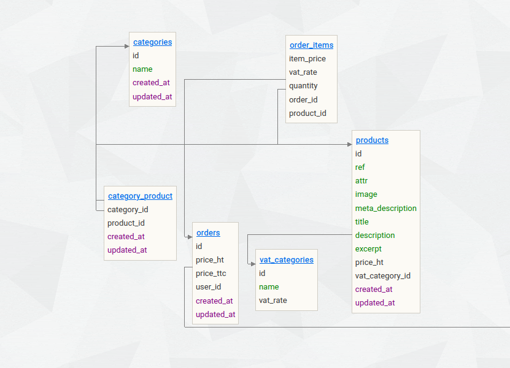

# Enoncé Challenge : fonctions postgreSQL

---

En France, il y a plusieurs taux de TVA, il faudra donc faire une fonction SQL qui calcule le total TTC d'une commande en se basant sur le taux de TVA de chaque produit. Cette fonction devra retourner un tableau contenant le montant HT, le total de TVA, ainsi que le montant TTC d'une commande.

Il y a une méthode `calculateOrderPrice` sur le modèle `Order` qui fait appel à la fonction SQL `calculate_order_price` que vous aurez codé.

Pour tester, il faudra utiliser le controller `OrdersController`  et simuler une commande (le code est fourni).

Voici un schéma des tables qui vous serviront pour cet exercice

- La table `order_items` contient les produits liées à une commande
- La table `products` contient une référence à un taux de TVA, le taux de TVA d'un produit peut ainsi être enregistré dans une ligne de `order_items`

## Installation

Après avoir cloné le repo :

-   Renommer le fichier `/server/.env.example` en `/server/.env`
-   Installer la BDD
-   `npm i && npm run install && nm run watch`
-   Si besoin, il y a aussi les scripts `npm run update` et `npm run audit`.

### BDD

> Se connecter à adminer avec les infos suivantes [http://localhost:8080](http://localhost:8080)
>
> user : student , mdp : secret, bdd : shopping
>
> Il y a plusieurs users dans la BDD, avec un mot de passe unique : secret
> 
> Si besoin, la route `/install` crée ou reset la BDD.
